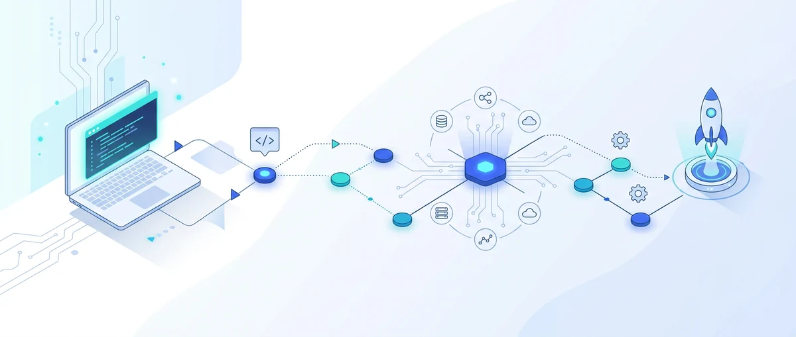
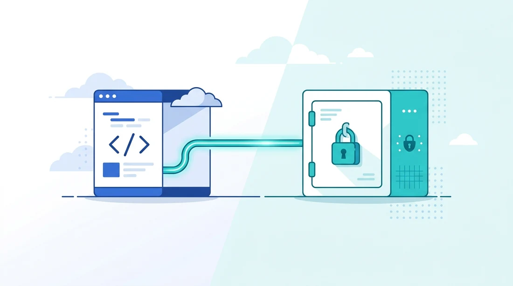
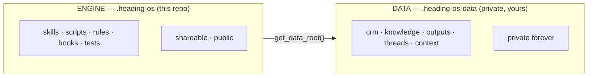

<div align="center">



# HEADING OS

**The operating system an executive runs their company from** — research, communications, CRM, content, and operations.
[Claude Code](https://claude.com/product/claude-code) is the foundation; HEADING OS is the value built on top: sovereign, security-first, your data kept private.

[](LICENSE)
[](pyproject.toml)
[](tests/)
[](pyproject.toml)
[](https://claude.com/product/claude-code)

</div>

---

HEADING OS is the workspace an executive actually runs their work from — research, communications, CRM, content, operations — with Claude Code as the agent and a strict line drawn between the code and the data. The code is a shareable engine. The data is a private repository the engine never contains and never leaks. That separation is the whole design, and it is enforced, not just intended.

It is named after its operating philosophy: the **Navigation Principle** — you set a heading and hold it, correcting course as conditions change, rather than steering toward a fixed point and hoping. The same idea runs through the system: durable state over one-shot prompts, verified completion over hopeful timeouts, operational states over rigid targets.

## The two-repository design

Most agent setups keep code and data in one place. HEADING OS splits them on purpose.

<div align="center">

</div>



- **ENGINE** (this repo) — skills, scripts, rules, hooks, and tests. No real data, no secrets, no personal information. Shareable, and intended to be public.
- **DATA** (a separate private repo, yours) — CRM, knowledge, generated outputs, operational threads, and context. The engine resolves it at runtime through a single seam (`get_data_root()`), as a sibling directory or via the `HEADING_OS_DATA` environment variable.

You clone the engine; you create your own private data repository ([one command](docs/DEPLOYMENT.md#5-clone-the-repositories)); you wire them together. The engine carries the logic, your data stays with you.

## What's inside

- **Skills** — slash-command workflows for research, communications, content, CRM, strategy, and operations, routed from natural language by a single router rule.
- **Hooks** — `PreToolUse` / `PostToolUse` / `SessionStart` guards that enforce the rules below before a write ever lands.
- **Daemons** — optional always-on background services (a loopback dashboard, mail/calendar sync) that are driven from the CLI, never required through a browser.
- **A security model with teeth** — not policy prose alone:
  - **Engine ⟂ data separation** is proven by six enforcement layers (a bypass guard, a leak guard, a data-path redirect, a build partition, a runtime tree-clean check, and an unbypassable push-time wall in pure code), so the engine clone cannot carry private data regardless of how a file was written — and the data cannot leave on the push, on any path.
  - **Outbound send is always human-gated** — the lethal-trifecta control. An agent can draft and queue a message; a human clicks before anything leaves.
  - **Secrets never reach a remote** — a content scan on the sanctioned push path is pure code with no skip flag, behind a bypassable commit-time hook.
  - **No "hope-based" waiting** — every must-complete step (every push) runs under a progress watchdog that declares a hang only on real inactivity and verifies the postcondition, never trusting a wall-clock timeout or a bare exit code.
- **Console-first** — every capability is operable from the terminal and from Claude Code chat. The dashboard is a convenience layer, never a dependency.

## Quickstart

The full documentation — prerequisites &amp; install, daemons &amp; scheduled tasks, the skill/MCP/plugin catalog, the memory systems &amp; ODIN, and the data-overlay structure — is published as a browsable site at **[mishahanin.github.io/heading-os](https://mishahanin.github.io/heading-os/)**.

The zero-to-running walk-through — WSL2, toolchain, prerequisites, Claude Code, your private data repo, and the engine wired to it — is in **[docs/DEPLOYMENT.md](docs/DEPLOYMENT.md)** (with [docs/QUICKSTART.md](docs/QUICKSTART.md) for the short version).

The short version, once the prerequisites are in place:

```bash
# 1. Clone the engine
git clone https://github.com/mishahanin/heading-os.git .heading-os
cd .heading-os

# 2. Install dependencies (Python 3.11, managed by uv)
uv sync

# 3. Create your own private data repository (one command)
uv run python scripts/create-data-repo.py

# 4. Wire secrets and arm the commit gate
cp .env.example .env        # fill in what you use
pre-commit install

# 5. Verify, then start
uv run python scripts/workspace-health.py
claude       # then /prime
```

## Repository layout

| Path | What it holds |
|------|---------------|
| `.claude/` | Skills, rules, and hooks — the agent's behaviour |
| `scripts/` | CLI tools and `scripts/utils/` shared modules |
| `config/` | `routing-map.yaml` (the data/engine classifier) and engine config |
| `docs/` | The deployment guide, the segregation contract, and this engine's docs |
| `tests/` | The regression suite (security tests under `tests/security/`) |
| `reference/` | Engine reference material |
| `examples/` | A read-only demo data tree for a data-less clone |

## Security

Security is treated as a first-class concern, not an afterthought. The reporting policy and the full posture are in **[SECURITY.md](SECURITY.md)**; the engine ⟂ data guarantee is specified in **[docs/engine-data-segregation-contract.md](docs/engine-data-segregation-contract.md)**.

If you find a vulnerability, please report it privately (see SECURITY.md) rather than opening a public issue.

## Status

`v0.1.0`. The architecture, the security model, and the data seam are stable and load-bearing. Skills and daemons evolve. Interfaces may change between minor versions while the project is pre-1.0.

## Contributing

Issues — bug reports, questions, and ideas — are welcome. Pull requests are accepted **by invitation**: please open an issue to discuss a change before sending code, so the work fits the direction. See **[CONTRIBUTING.md](CONTRIBUTING.md)** and the **[Code of Conduct](CODE_OF_CONDUCT.md)**.

## License

Apache License 2.0 — see **[LICENSE](LICENSE)** and **[NOTICE](NOTICE)**. You may use, modify, and distribute the engine with attribution; the patent grant and trademark terms are in the license. HEADING OS, ODUN.ONE, and the 31 Concept marks are trademarks of 31 Concept.

## Author

Built by **Misha Hanin**, Founder & CEO of [31 Concept](https://31c.io) (31C) — `misha.hanin@odinix.com`.

<div align="center"><sub>Set a heading. Hold it.</sub></div>
