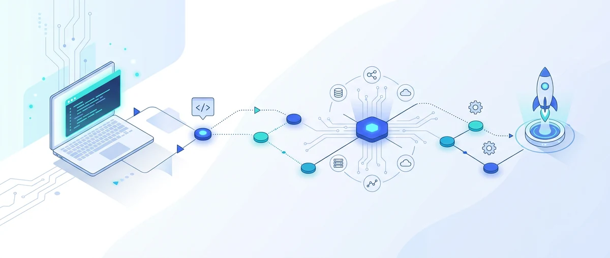
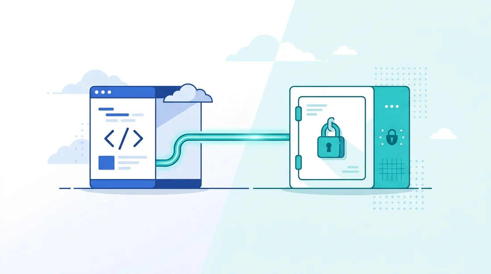
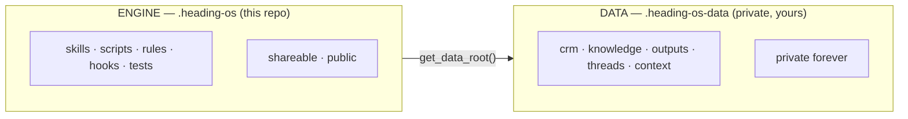

<div align="center">



# HEADING OS

**The operating system an executive runs their company from** — research, communications, CRM, content, and operations.
[Claude Code](https://claude.com/product/claude-code) is the foundation; HEADING OS is the value built on top: sovereign, security-first, your data kept private.

[](LICENSE)
[](pyproject.toml)
[](https://github.com/mishahanin/heading-os/actions/workflows/ci.yml)
[](pyproject.toml)
[](https://claude.com/product/claude-code)

<br>



</div>

---

HEADING OS runs on one guarantee: your data cannot ship with the code. The engine is a shareable, public repository; your data is a private one the engine never contains and never leaks. That separation is enforced by six mechanical layers and a security suite that runs on every commit, not just intended. On top of it sits the workspace an executive actually runs their work from: research, communications, CRM, content, and operations, with Claude Code as the agent.

It is named after its operating philosophy: the **[Navigation Principle](docs/GLOSSARY.md)** — you set a heading and hold it, correcting course as conditions change, rather than steering toward a fixed point and hoping. The same idea runs through the system: durable state over one-shot prompts, verified completion over hopeful timeouts, operational states over rigid targets. New to the house vocabulary (heading, drift, operational state, engine vs data)? The **[glossary](docs/GLOSSARY.md)** defines every term in a line.

## The two-repository design

Most agent setups keep code and data in one place. HEADING OS splits them on purpose.

<div align="center">

</div>


```mermaid
flowchart LR
  subgraph ENGINE["ENGINE — .heading-os (this repo)"]
    direction TB
    E1["skills · scripts · rules · hooks · tests"]
    E2["shareable · public"]
  end
  subgraph DATA["DATA — .heading-os-data (private, yours)"]
    direction TB
    D1["crm · knowledge · outputs · threads · context"]
    D2["private forever"]
  end
  ENGINE -->|"get_data_root()"| DATA
```

- **ENGINE** (this repo) — skills, scripts, rules, hooks, and tests. No real data, no secrets, no personal information. Shareable, and intended to be public.
- **DATA** (a separate private repo, yours) — CRM, knowledge, generated outputs, operational threads, and context. The engine resolves it at runtime through a single seam (`get_data_root()`), as a sibling directory or via the `HEADING_OS_DATA` environment variable.

You clone the engine; you create your own private data repository ([one command](docs/DEPLOYMENT.md#5-clone-the-repositories)); you wire them together. The engine carries the logic, your data stays with you.

## What's inside

- **Skills** — slash-command workflows for research, communications, content, CRM, strategy, and operations, routed from natural language by a single router rule.
- **Hooks** — `PreToolUse` / `PostToolUse` / `SessionStart` guards that enforce the rules below before a write ever lands.
- **Daemons** — optional always-on background services (a loopback dashboard, mail/calendar sync) that are driven from the CLI, never required through a browser.
- **A security model with teeth** — not policy prose alone:
  - **Engine ⟂ data separation** is proven by six enforcement layers (a bypass guard, a leak guard, a data-path redirect, a build partition, a runtime tree-clean check, and an unbypassable push-time wall in pure code), so the engine clone cannot carry private data regardless of how a file was written — and the data cannot leave on the push, on any path.
  - **Outbound send is always human-gated** — the lethal-trifecta control. An agent can draft and queue a message; a human clicks before anything leaves.
  - **Secrets never reach a remote** — a content scan on the sanctioned push path is pure code with no skip flag, behind a bypassable commit-time hook.
  - **No "hope-based" waiting** — every must-complete step (every push) runs under a progress watchdog that declares a hang only on real inactivity and verifies the postcondition, never trusting a wall-clock timeout or a bare exit code.
- **Console-first** — every capability is operable from the terminal and from Claude Code chat. The dashboard is a convenience layer, never a dependency.

## By the numbers

Every figure here is produced by CI, not asserted by hand. Counts as of `v0.13.0`, kept honest by `scripts/dev/check-readme-numbers.py`.

- **412 security tests**, run on every commit by the [`security-tests`](.github/workflows/ci.yml) job over [`tests/security/`](tests/security). This is the suite that proves the guarantees below.
- **6 enforcement layers** hold the engine and data apart: a [bypass guard](tests/test_data_root_no_bypass.py), a [leak guard](scripts/leak-guard.py), a data-path redirect hook, a build partition, a [runtime tree-clean check](tests/test_engine_tree_clean.py), and an [unbypassable push-time wall](scripts/push-all.py).
- **Router accuracy**: pending. The nightly router-accuracy trend (F-6.2) needs a week of data before a number is published here.

## Quickstart

The full documentation — prerequisites &amp; install, the architecture overview, the security model, daemons &amp; scheduled tasks, the skill/MCP/plugin catalog, the AI model integrations (local Ollama embeddings, the Council models), the service integrations (Exchange email, Telegram, Google, OSINT), workspace personalization, a guide to extending the engine, the memory systems &amp; ODIN, and the data-overlay structure — is published as a browsable site at **[mishahanin.github.io/heading-os](https://mishahanin.github.io/heading-os/)**.

The zero-to-running walk-through — WSL2, toolchain, prerequisites, Claude Code, your private data repo, and the engine wired to it — is in **[docs/DEPLOYMENT.md](docs/DEPLOYMENT.md)** (with [docs/QUICKSTART.md](docs/QUICKSTART.md) for the short version).

Just want a taste inside your existing Claude Code, with no clone? Install the sovereignty core as a plugin from the marketplace:

```
/plugin marketplace add mishahanin/heading-os-marketplace
/plugin install heading-core@heading-os-marketplace
```

The marketplace repo is **[mishahanin/heading-os-marketplace](https://github.com/mishahanin/heading-os-marketplace)**; **[docs/PLUGINS.md](docs/PLUGINS.md)** covers the bundles, how updates work, and when to prefer a plugin over a full clone.

Three focused setup guides cover everything beyond the core install:

- **[docs/MODELS-SETUP.md](docs/MODELS-SETUP.md)** — the AI models: installing **Ollama** for the local `bge-m3` embedder behind `/recall`, and wiring **Gemini, Grok, and Kimi** as the `/council` voices.
- **[docs/INTEGRATIONS-SETUP.md](docs/INTEGRATIONS-SETUP.md)** — the services: **Exchange** email, **Telegram**, **Google** contacts, and the **OSINT / web-research** APIs, with where to get each key and how to verify.
- **[docs/MAKE-IT-YOURS.md](docs/MAKE-IT-YOURS.md)** — personalizing a clone: `/setup-wizard` to generate your voice, business, and personal docs, set your identity, and adapt the house terminology to your own.

The short version, once the prerequisites are in place:

```bash
# 1. Clone the engine (git-lfs carries the brand assets and binary test fixtures)
git lfs install
git clone https://github.com/mishahanin/heading-os.git .heading-os
cd .heading-os

# 2. Install dependencies (Python 3.11, managed by uv)
uv sync

# 3. Create your own private data repository (one command)
uv run python scripts/create-data-repo.py

# 4. Wire secrets and arm the commit gate
cp .env.example .env        # fill in what you use
pre-commit install

# 5. Verify, then start
uv run python scripts/workspace-health.py
claude       # then /prime
```

## Repository layout

| Path | What it holds |
|------|---------------|
| `.claude/` | Skills, rules, and hooks — the agent's behaviour |
| `scripts/` | CLI tools and `scripts/utils/` shared modules |
| `config/` | `routing-map.yaml` (the data/engine classifier) and engine config |
| `docs/` | The deployment guide, the segregation contract, and this engine's docs |
| `tests/` | The regression suite (security tests under `tests/security/`) |
| `reference/` | Engine reference material |
| `examples/` | A read-only demo data tree for a data-less clone |

## Security

Security is treated as a first-class concern, not an afterthought. The model is walked through end to end in **[docs/SECURITY-MODEL.md](docs/SECURITY-MODEL.md)** (the lethal-trifecta control, the engine/data layers, the send-gate, the secret gates); the reporting policy and posture summary are in **[SECURITY.md](SECURITY.md)**; the engine ⟂ data guarantee is specified in **[docs/engine-data-segregation-contract.md](docs/engine-data-segregation-contract.md)**.

If you find a vulnerability, please report it privately (see SECURITY.md) rather than opening a public issue.

## Status

<!-- version: keep in sync with pyproject.toml; checked by scripts/check-version-sync.py -->
`v0.13.0`. The architecture, the security model, and the data seam are stable and load-bearing. Skills and daemons evolve. Interfaces may change between minor versions while the project is pre-1.0. See **[ROADMAP.md](ROADMAP.md)** for direction and **[CHANGELOG.md](CHANGELOG.md)** for what has changed.

What v0.13.0 changed, written for a reader rather than for a diff: **[docs/RELEASE-NOTES.md](docs/RELEASE-NOTES.md)** ([published page](https://mishahanin.github.io/heading-os/RELEASE-NOTES.html)).

## Contributing

Issues — bug reports, questions, and ideas — are welcome. Pull requests are accepted **by invitation**: please open an issue to discuss a change before sending code, so the work fits the direction. See **[CONTRIBUTING.md](CONTRIBUTING.md)** and the **[Code of Conduct](CODE_OF_CONDUCT.md)**.

## License

Apache License 2.0 — see **[LICENSE](LICENSE)** and **[NOTICE](NOTICE)**. You may use, modify, and distribute the engine with attribution; the patent grant and trademark terms are in the license. ODUN.ONE, TrustONE, and the 31 Concept marks are trademarks of 31 Concept, referenced here only as example vocabulary.

## Ownership & disclaimer

HEADING OS is a personal project created and maintained by **Misha Hanin**. Misha is the Founder & CEO of [31 Concept](https://31c.io) (31C) and uses HEADING OS in his own work and life, but HEADING OS is his personal project. **31 Concept is not involved in HEADING OS, does not maintain, sponsor, or endorse it, and bears no responsibility or liability for it.** Any vocabulary that resembles 31C's (ODUN.ONE, TrustONE, DPI+, Tribe, and similar) appears only as illustrative example data and does not imply 31C involvement.

Every name, company, contact detail, figure, and scenario used as an **example** anywhere in this repository, its documentation, or anything generated from it is **fictional** and exists only to show how the software behaves; any resemblance to a real person or organisation is coincidental and unintended. If an example resembles you, write to `misha.hanin@odinix.com` with the subject `HEADING OS naming` and it will be changed — no need to demonstrate harm or assert a right. Full notice: **[DISCLAIMER.md](DISCLAIMER.md)**.

## Author

Built by **Misha Hanin** as a personal project (`misha.hanin@odinix.com`).

<div align="center"><sub>Set a heading. Hold it.</sub></div>
