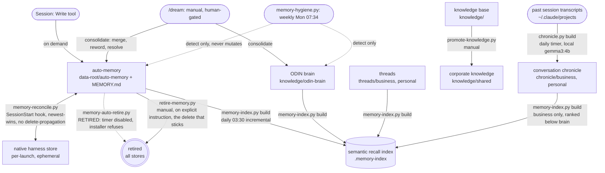

# Memory lifecycle

One map of the six memory stores and the exact script or hook that moves data between them, with the trigger and cadence on every edge.

Last Updated: 2026-08-08

HEADING OS keeps memory in six mechanisms. Each is documented on its own; what this page adds is the lifecycle: where a fact is written, how it is indexed for recall, when it is retired, and how the per-launch store stays in sync with the durable one. The diagram is the mechanism only. It names stores and the scripts that move data, never any real memory content.

## The map



## The stores

| Store | Location | Side |
| --- | --- | --- |
| auto-memory | `data-root/auto-memory/*.md` + `MEMORY.md` | DATA (private) |
| native harness store | per-launch Claude Code native memory dir | DATA (ephemeral) |
| semantic recall index | `data-root/.memory-index/`, plus engine `.memory-index-code/` | DATA + engine |
| ODIN brain | `data-root/knowledge/odin-brain/` | DATA (private) |
| knowledge base | `data-root/knowledge/` (+ `knowledge/shared/`) | DATA (private) |
| threads | `data-root/threads/business`, `personal` | DATA (private) |
| conversation chronicle | `data-root/chronicle/business`, `personal` | DATA (private) |

The conversation chronicle is a distinct historical CLASS, not one of the belief stores above. It records "on date X we discussed Y" from past session transcripts; it is never promoted into the brain and never treated as a current fact. It is listed here because it shares the recall index, ranked below the belief stores, with its personal subtree air-gapped.

## The edges, one by one

- **Write during a session (on demand).** A fact is written to auto-memory (`data-root/auto-memory/*.md`) with a one-line pointer added to `MEMORY.md`. This is the canonical, durable home.
- **Reconcile, `.claude/hooks/memory-reconcile.py` (SessionStart).** The per-launch native harness store and the canonical DATA auto-memory are synced newest-wins. It NEVER propagates deletions, so a file removed on one store alone is resurrected from the other at the next session start. That is why a real delete needs an all-store retire.
- **Auto-retire, `scripts/memory-auto-retire.py` — RETIRED, and disabled.** Clock-driven retirement is switched off. Auto-memory is never pruned: a memory that has gone unused sinks in recall ranking and stays retrievable, and removal happens only when the operator asks for it. `/dream` no longer stamps `expires:`, so the pass's only trigger no longer accrues; the timer is not installed, and `scripts/install-memory-auto-retire-timer.sh` refuses to install one unless the directive is explicitly overridden. The script and its unit templates stay on disk so reversing the decision is a one-line change, not an archaeology exercise.
- **Manual retire, `scripts/retire-memory.py`.** Removes a named record from ALL stores at once, on an explicit operator instruction. This is the only delete that sticks, given the reconcile hook's no-deletion-propagation rule, and it is now the ONLY route out of memory.
- **Index build, `scripts/memory-index.py build` (daily 03:30, incremental).** Rebuilds the local semantic recall index over the business memory corpus (Odin brain, business threads, business CRM) and the auto-memory records, computed locally via ollama `bge-m3`. Recall is hybrid: a dense channel (bge-m3 cosine, threshold-gated) fused with a sparse channel (SQLite FTS5 BM25) by reciprocal rank fusion. Query it with `memory-index.py query "<text>"`.
- **Promote, `scripts/promote-knowledge.py` (manual).** Copies a personal `knowledge/` note into corporate `knowledge/shared/{type}/` with provenance, for sharing down to executives.
- **Consolidate, `/dream` (manual, human-gated).** The judgement pass: merges duplicates, rewords, resolves contradictions, clears orphans across auto-memory and the ODIN brain. Nothing here is automatic, and nothing here proposes a removal: a superseded fact is rewritten in place so the record survives.
- **Chronicle build, `scripts/chronicle.py build` (daily timer, incremental).** Summarizes past session transcripts (top-level sessions only, never nested subagent logs) with a local model (`gemma3:4b`) into one dated entry per non-trivial conversation, tagged business or personal. Business entries index into the `chronicle` collection, recalled BELOW the belief stores. Personal entries are NEVER indexed (the `personal` segment is a hard-coded air-gap deny); they are recallable only on explicit demand via `scripts/chronicle.py personal-recall`, which reads `chronicle/personal/*.md` on the fly (local bge-m3, lexical fallback) and persists nothing - so personal life never surfaces into a working/send context unless the CEO summons it. It never writes to the brain and never sends anything, so it is safe to run unattended - the same family as the daily index build.
- **Hygiene, `scripts/memory-hygiene.py` (weekly Monday 07:34).** A detector, never a mutator. It aggregates objective defects (orphan memory files, `MEMORY.md` over budget, Odin temporal-validity errors) into one dated report and exits non-zero when any is present. A human resolves what it finds, usually via `/dream`.

## Driving it from one place

The six operations have one console-first entry point, `scripts/memory.py`, a thin facade that shells out to the scripts above with no behavior change:

```
python scripts/memory.py status      # read-only overview (index stats + knowledge health + count)
python scripts/memory.py recall "<text>"   # semantic query over the index
python scripts/memory.py promote --note <path>   # promote a knowledge note to corporate
python scripts/memory.py retire <name> [<name> ...]   # all-store retire
python scripts/memory.py reconcile   # sync native store with canonical (CLI mode)
python scripts/memory.py hygiene     # run the defect detector
```

Each subcommand returns the underlying script's exit code and degrades with a plain message when a backing script or store is absent.

## What this map deliberately leaves out

- Real memory content. The stores are named; nothing private is shown.
- The ODIN brain's internal maintenance (`odin` compile, pagerank, lint), which operates inside the brain rather than moving data between stores.
- Read-only health detectors (`knowledge-health.py`, `odin-brain-health.py`), which report but move nothing.

See also the [Memory and Odin](memory-odin.html) page for how the auto-memory and ODIN brain are used in practice.
